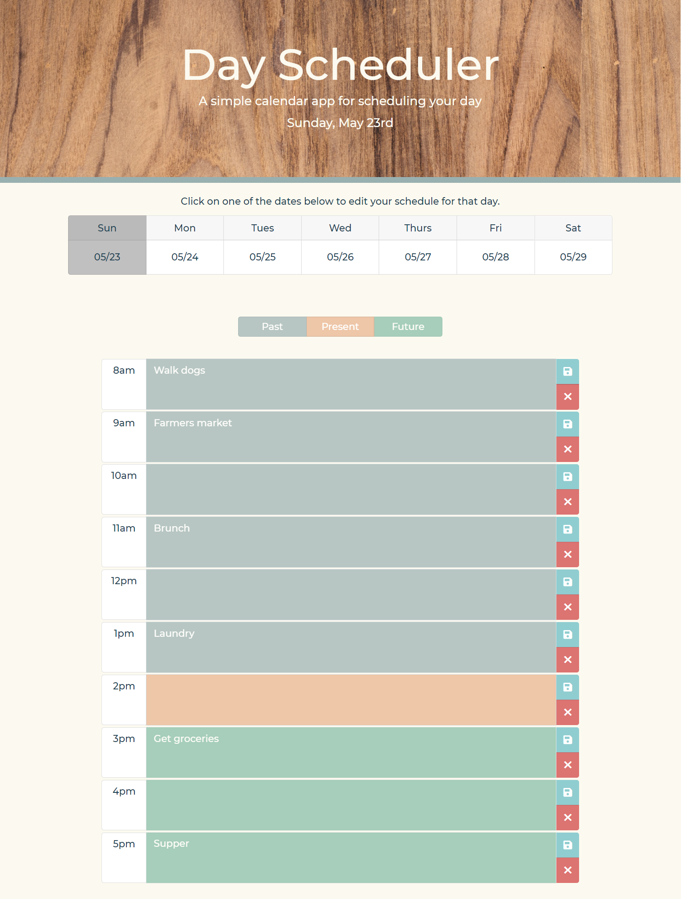

# 05 Third-Party APIs: Work Day Scheduler

## Summary

This work day scheduler is designed to assist you with your daily schedule. It will display the current day's date and a time slot for each hour of the work day. When you press the save button, it saves your entry.

## Key Features

Key features of the calendar include:

* Dynamic date at the top of the page that will update depending on the day
* Each time block is created dynamically using a jQuery for loop
* Dynamic coloring for each input, depending on the time of day
    * Gray for hours past
    * Peach/red for currrent hour
    * Green for future hours
* When you click the save button, an event listeners saves your entry to local storage
* When you want to update the entry, it will write over the previous data and store your new entry to local storage
* A pop-up will also appear when the save button is clicked, notifying you about the entry you created
* At midnight, the calenar is automatically cleared out for the next day
* Bootstap input and button components, modified for the calendar entries
* Third-Party APIs:
    * Bootstrap
    * jQuery
    * Google Fonts
* Appealing design

## Link to Deploy

[Workday Calendar](https://leighdahlin.github.io/homework5/)

## Screenshots

